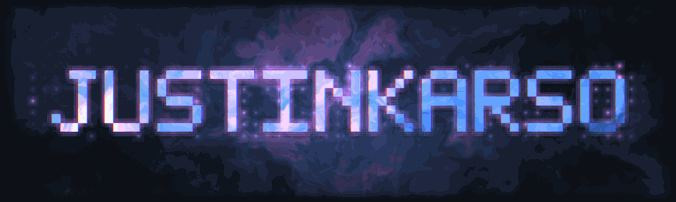
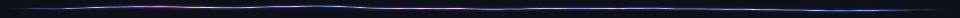
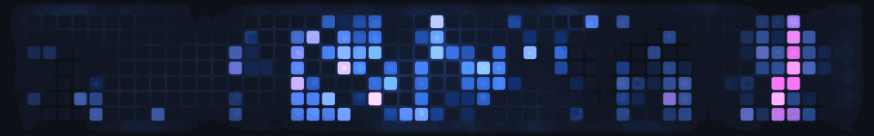

<!-- vgpu:banner:start -->

<!-- vgpu:banner:end -->

<!-- vgpu:rule-1:start -->

<!-- vgpu:rule-1:end -->

### 🧑‍💻 About Me

I'm a web developer based in the Netherlands, building modern web experiences with React, TypeScript, and Node.js. I love exploring new technologies — from Rust and WASM to AI-powered tools.

<!-- vgpu:rule-2:start -->

<!-- vgpu:rule-2:end -->

### 🛠 Languages & Technologies

**Languages**

**Frameworks & Libraries**

**Infrastructure & Tools**

<!-- vgpu:rule-3:start -->

<!-- vgpu:rule-3:end -->

### 🚀 Recent Projects

| Project | Description |
|---------|-------------|
| [**Docframe**](https://docframe.dev) | AI doc generation |
| [**Webvork**](https://recurno.com) | Monthly subscription tracker |
| [**Webvork**](https://webvork.nl) | Web development agency |
| [**portzap**](https://github.com/Justinkarso/portzap) | Fast cross-platform port management tool, written in Rust |
| [**makesite**](https://github.com/Justinkarso/makesite) | Minimal static site generator in Rust: write Markdown, get a website |
| [**maildrop**](https://github.com/Justinkarso/maildrop) | Resend-like API over free SMTP, with auto-detected settings |
| [**EnvShare**](https://github.com/Justinkarso/EnvShare) | Peer-to-peer `.env` sharing on your own network, no cloud |

<!-- vgpu:rule-4:start -->

<!-- vgpu:rule-4:end -->

<!-- vgpu:year:start -->

<!-- vgpu:year:end -->

### 🖥 About the art on this page

None of it is an image anybody drew. The banner, the panel above, and the four
lines between the sections are WGSL shaders, rendered headless on a GPU by
[vgpu](https://vgpu.sh) and re-rendered every night by a workflow. The fog is
domain-warped noise. The tiles are days from my contribution graph, pulled from
the GitHub API and used as texture rather than as a chart.

The shaders are generated rather than written: every build emits fresh WGSL next
to each GIF, with the days baked in as a constant array and the name packed into
a 5x7 bitmap font. That leaves each shader with a single uniform, the phase of
the loop, which is what makes the animations join back to their first frame
exactly.
